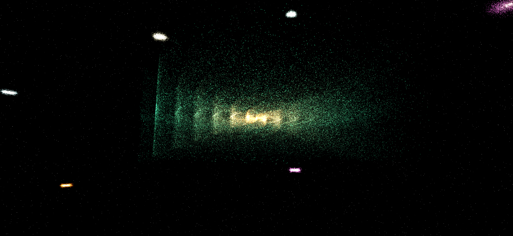

# 🌌 Cosmo Shader



Web-based galaxy generator powered by Next.js, Three.js, and React Three Fiber. Custom shaders render real-time spiral galaxies and nebulas; edit code live, tweak parameters, and share scenes via URL presets.

## 🚀 Technologies

- [Next.js 15](https://nextjs.org/)
- [Three.js](https://threejs.org/)
- [@react-three/fiber](https://docs.pmnd.rs/react-three-fiber/)
- [@react-three/drei](https://github.com/pmndrs/drei)
- GLSL (Vertex + Fragment Shaders)
- `pnpm` as package manager

## 📦 Installation

```bash
pnpm install
pnpm dev
```

> Requires **Node.js >= 20** and **pnpm >= 8.14.0**
